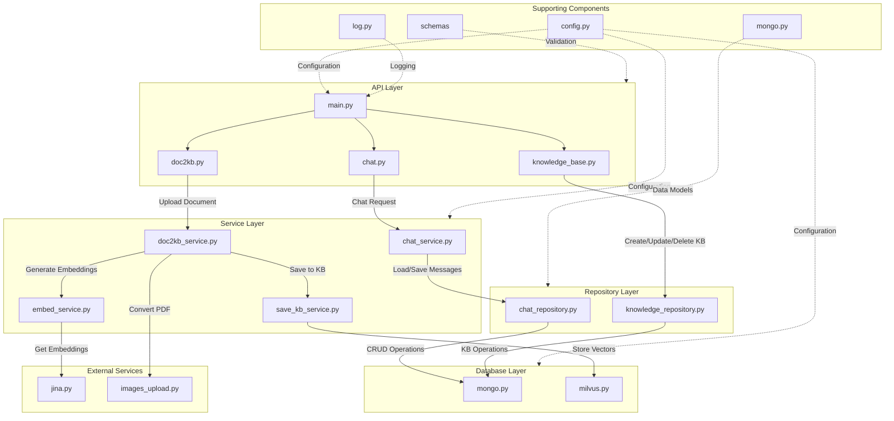
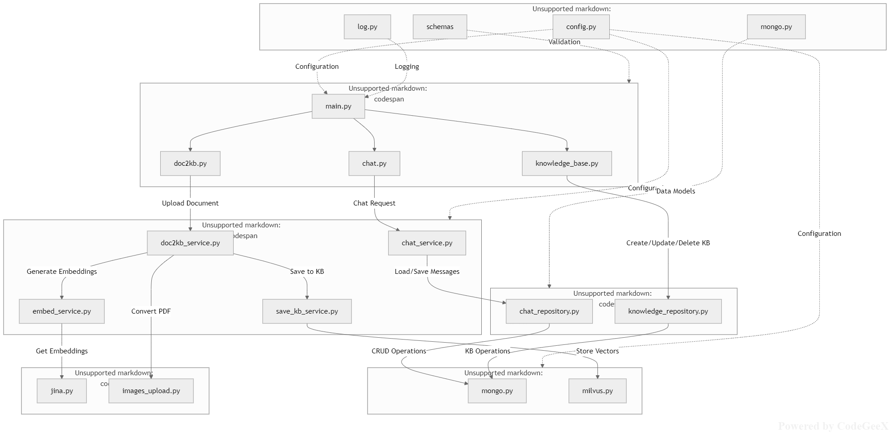

# 智能问答系统

一个基于 FastAPI 构建的智能问答系统，集成了 RAG（检索增强生成）架构，支持知识库管理、文档解析、向量检索及流式对话功能。

## ✨ 主要特性

- 🤖 **智能流式对话**：基于大语言模型（LLM）的流式响应，提供流畅的聊天体验。
- 📚 **知识库管理**：支持创建、更新、删除知识库，以及库内文件管理。
- 📄 **文档处理**：支持 PDF 文档上传，自动转换为图片并进行向量化处理。
- 🔍 **RAG 架构**：结合向量检索与生成模型，基于特定知识库回答问题。
- 🗄️ **双数据库支持**：使用 MongoDB 存储元数据和对话历史，使用 Milvus 存储向量数据。
- 🚀 **高性能异步**：基于 FastAPI 和 AsyncIO 的全异步架构。

## 🛠️ 技术栈

| 类别 | 技术 |
| :--- | :--- |
| Web 框架 | FastAPI, Uvicorn |
| 数据库 | MongoDB, Milvus |
| AI/LLM | OpenAI API, Jina AI |
| 数据处理 | MongoEngine, Pydantic |
| 图像处理 | pdf2image |

## 📁 项目结构

```
.
├── src/
│   ├── api/                 # API 接口层
│   │   ├── chat.py          # 聊天相关接口
│   │   ├── doc2kb.py        # 文档上传与处理接口
│   │   ├── knowledge_base.py # 知识库管理接口
│   │   └── main.py          # 应用入口
│   ├── service/             # 业务逻辑层
│   │   ├── chat_service.py  # 聊天核心逻辑
│   │   ├── doc2kb_service.py # 文档处理逻辑
│   │   ├── embed_service.py # 向量化服务
│   │   └── save_kb_service.py # 知识库存储逻辑
│   ├── repositories/        # 数据访问层
│   │   ├── chat_repository.py
│   │   └── knowledge_repository.py
│   ├── db_conn/             # 数据库连接
│   │   ├── mongo.py
│   │   └── milvus.py
│   ├── models/              # 数据模型
│   │   └── mongo.py
│   ├── schemas/             # Pydantic 模型 (请求/响应验证)
│   ├── external/            # 外部服务调用
│   │   ├── jina.py          # Jina AI 接口
│   │   └── images_upload.py # 图片上传服务
│   ├── config.py            # 配置文件
│   └── log.py               # 日志中间件
├── requirements.txt         # 依赖列表
└── README.md                # 项目说明
```

## 🚀 快速开始

### 1. 环境准备

确保你的环境已安装 Python 3.8+。

### 2. 安装依赖

```bash
pip install -r requirements.txt
```

### 3. 配置环境变量

请根据你的实际情况修改 `src/config.py` 或设置环境变量，通常需要配置：

- `MONGO_URI`: MongoDB 连接字符串
- `MILVUS_HOST`: Milvus 服务地址
- `MILVUS_PORT`: Milvus 服务端口
- `OPENAI_API_KEY`: OpenAI API 密钥
- `JINA_API_KEY`: Jina AI API 密钥

### 4. 启动服务

```bash
# 开发模式启动
uvicorn src.api.main:app --reload --host 0.0.0.0 --port 8000
```

访问 [http://localhost:8000/docs](http://localhost:8000/docs) 查看 API 文档。

## 📖 API 使用示例

### 1. 创建知识库

```bash
curl -X POST "http://localhost:8000/kb/" \
  -H "Content-Type: application/json" \
  -d '{"kb_name": "my_first_kb", "description": "我的第一个知识库"}'
```

### 2. 上传文档并处理

```bash
curl -X POST "http://localhost:8000/doc/upload" \
  -F "file=@document.pdf" \
  -F "kb_id=<your_kb_id>"
```

### 3. 流式对话

```bash
curl -N "http://localhost:8000/chat/stream?kb_id=<your_kb_id>&prompt=你好，请介绍一下这个项目"
```

## 🔧 核心功能说明

### RAG 工作流

1. **文档上传**：用户上传 PDF 文档。
2. **预处理**：系统将 PDF 转换为图片，并上传至对象存储。
3. **向量化**：调用 Jina AI 将文本内容转换为 Embedding 向量。
4. **存储**：向量数据存入 Milvus，元数据存入 MongoDB。
5. **检索**：用户提问时，在 Milvus 中检索相关文档片段。
6. **生成**：将检索到的上下文注入 LLM，生成最终回答。

### 数据流图



## 📝 许可证

[MIT License](LICENSE)

## 👥 贡献

欢迎提交 Issue 和 Pull Request！