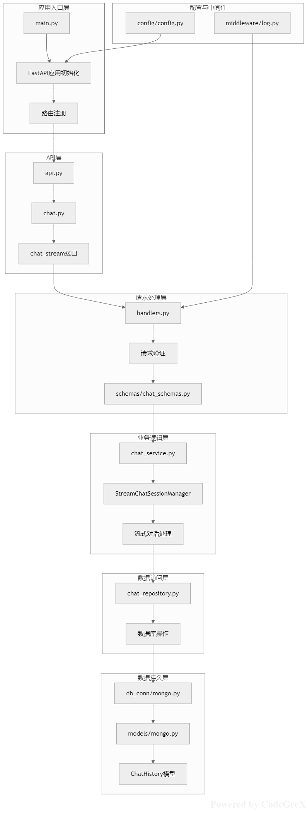

# 智能体基本框架

## 项目简介
一个基于 FastAPI 构建的高性能智能体（Agent）框架，支持与 OpenAI 模型集成，并使用 MongoDB 进行数据持久化。该框架提供了灵活的智能体开发基础结构，便于快速构建和部署各类 AI 应用。

## 主要特性
- 🚀 **高性能后端**：基于 FastAPI 构建，支持异步处理，提供高效的 API 服务
- 🤖 **多模型支持**：集成 OpenAI GPT 系列模型，支持灵活的对话管理
- 💾 **数据持久化**：使用 MongoDB 进行数据存储，支持结构化和非结构化数据
- 🔧 **模块化设计**：采用插件化架构，易于扩展和维护
- 📊 **可观测性**：内置日志记录和监控功能，便于调试和性能分析

## 技术架构

### 核心组件
- **API 服务层**：FastAPI 驱动的 RESTful API 接口
- **智能体引擎**：负责对话流程管理和任务调度
- **数据访问层**：MongoDB 数据库操作封装
- **模型集成层**：OpenAI API 调用封装

### 依赖技术栈
- **Web框架**：FastAPI
- **数据库**：MongoDB
- **AI模型**：OpenAI GPT系列
- **异步支持**：asyncio
- **数据验证**：Pydantic

## 快速开始

### 环境要求
- Python 3.8+
- MongoDB 5.0+
- OpenAI API 密钥

  